<div align="center">

<!-- SVG Wave Header -->


<!-- Typing Animation -->
<a href="https://git.io/typing-svg">
  
</a>

<br/>

<!-- Profile Views & Followers -->

&nbsp;

&nbsp;


<br/><br/>

<!-- Social Badges -->
<a href="https://github.com/iamshahid22">
  
</a>
&nbsp;
<a href="https://linkedin.com/in/iamshahid1309">
  
</a>
&nbsp;
<a href="mailto:shahiddinshaik1@gmail.com">
  
</a>
&nbsp;
<a href="https://your-portfolio.vercel.app">
  
</a>

</div>

---

<!-- About Me Section -->
<div align="center">

## 🧑‍💻 About Me

</div>

```yaml
Name       : Shahiddin Shaik
Location   : Hyderabad, India 🇮🇳
Degree     : B.Tech — Computer Science & Engineering
Focus      : Full Stack Development | Cloud | AI & ML
Status     : Building, Learning, Growing 💡
Goal       : Become a skilled Software Engineer & travel the world 🌏
Hobbies    : Photography 📷 | Travel ✈️ | Sports 🏸 | Open Source 🌐
```

<div align="center">

<table>
<tr>
<td>

- 🎓 Graduate **B.Tech CSE** AITS Tirupati
- 💼 Training at **10000 Coders**, Hyderabad
- 🌱 Currently learning **DSA, Full Stack, AWS & ML**
- 🔭 Working on **FinTrack** — a FastAPI personal finance app
- 🤝 Open to **collaborations** and **internship opportunities**
- ⚡ Fun fact: I code better with lo-fi music on 🎵

</td>
<td>


</td>
</tr>
</table>

</div>

---

<!-- Tech Stack -->
<div align="center">

## 🛠️ Tech Stack & Tools

</div>

<div align="center">

### 💻 Programming Languages


### 🎨 Frontend


### ⚙️ Backend


### 🗄️ Databases


### ☁️ Cloud & DevOps


### 🔧 Tools


</div>

---

<!-- GitHub Analytics -->
<div align="center">

## 📊 GitHub Analytics

<!-- Auto Dark/Light Mode Stats -->
### 📈 GitHub Stats

<picture>
  <source media="(prefers-color-scheme: dark)" srcset="https://github-readme-stats.vercel.app/api?username=iamshahid22&show_icons=true&theme=tokyonight&hide_border=true&bg_color=0D1117&title_color=6EE7F7&icon_color=6e40c9&text_color=ffffff&count_private=true&include_all_commits=true" />
  <source media="(prefers-color-scheme: light)" srcset="https://github-readme-stats.vercel.app/api?username=iamshahid22&show_icons=true&theme=default&hide_border=true&title_color=0d76a8&icon_color=6e40c9&count_private=true&include_all_commits=true" />
  
</picture>
&nbsp;
<picture>
  <source media="(prefers-color-scheme: dark)" srcset="https://github-readme-stats.vercel.app/api/top-langs/?username=iamshahid22&layout=compact&theme=tokyonight&hide_border=true&bg_color=0D1117&title_color=6EE7F7&text_color=ffffff&langs_count=8" />
  <source media="(prefers-color-scheme: light)" srcset="https://github-readme-stats.vercel.app/api/top-langs/?username=iamshahid22&layout=compact&theme=default&hide_border=true&title_color=0d76a8&langs_count=8" />
  
</picture>

### 🔥 GitHub Streak

<picture>
  <source media="(prefers-color-scheme: dark)" srcset="https://github-readme-streak-stats.herokuapp.com/?user=iamshahid22&theme=tokyonight&hide_border=true&background=0D1117&ring=6EE7F7&fire=6e40c9&currStreakLabel=6EE7F7" />
  <source media="(prefers-color-scheme: light)" srcset="https://github-readme-streak-stats.herokuapp.com/?user=iamshahid22&theme=default&hide_border=true" />
  
</picture>

### 🏆 GitHub Trophies

<picture>
  <source media="(prefers-color-scheme: dark)" srcset="https://github-profile-trophy.vercel.app/?username=iamshahid22&theme=tokyonight&no-frame=true&no-bg=true&column=7&margin-w=4" />
  <source media="(prefers-color-scheme: light)" srcset="https://github-profile-trophy.vercel.app/?username=iamshahid22&theme=flat&no-frame=true&column=7&margin-w=4" />
  
</picture>

### 📉 Contribution Graph

<picture>
  <source media="(prefers-color-scheme: dark)" srcset="https://github-readme-activity-graph.vercel.app/graph?username=iamshahid22&bg_color=0D1117&color=6EE7F7&line=6e40c9&point=ffffff&area=true&hide_border=true" />
  <source media="(prefers-color-scheme: light)" srcset="https://github-readme-activity-graph.vercel.app/graph?username=iamshahid22&theme=github-compact&hide_border=true" />
  
</picture>

</div>

---

<!-- Featured Projects -->
<div align="center">

## 🚀 Featured Projects

</div>

<div align="center">
<table>
<tr>

<td width="50%">
<h3 align="center">🤖 AI Resume Analyzer & Job Matcher</h3>
<div align="center">
  <a href="https://github.com/iamshahid22/ai-resume-analyzer" target="_blank">
    
  </a>
  <a href="#" target="_blank">
    
  </a>
</div>
<p align="center">AI-powered tool that analyzes resumes and matches candidates to the best-fit job descriptions using NLP and ML techniques.</p>
<p align="center">
  
  
  
  
</p>
</td>

<td width="50%">
<h3 align="center">📅 Smart Scheduler & Productivity Tracker</h3>
<div align="center">
  <a href="https://github.com/iamshahid22/smart-scheduler" target="_blank">
    
  </a>
  <a href="#" target="_blank">
    
  </a>
</div>
<p align="center">A full-stack productivity app with smart scheduling, habit tracking, and analytics dashboard to supercharge your daily workflow.</p>
<p align="center">
  
  
  
</p>
</td>

</tr>
<tr>

<td width="50%">
<h3 align="center">🔐 Password Generator & Manager</h3>
<div align="center">
  <a href="https://github.com/iamshahid22/password-manager" target="_blank">
    
  </a>
  <a href="#" target="_blank">
    
  </a>
</div>
<p align="center">A secure, encrypted password manager with strong password generation, vault storage, and cross-device sync capabilities.</p>
<p align="center">
  
  
  
</p>
</td>

<td width="50%">
<h3 align="center">💪 AI Health & Fitness Planner</h3>
<div align="center">
  <a href="https://github.com/iamshahid22/ai-fitness-planner" target="_blank">
    
  </a>
  <a href="#" target="_blank">
    
  </a>
</div>
<p align="center">AI-driven fitness and nutrition planner that generates personalized workout schedules and meal plans based on your goals.</p>
<p align="center">
  
  
  
</p>
</td>

</tr>
<tr>

<td colspan="2">
<h3 align="center">🌐 Portfolio Website — Shahiddin</h3>
<div align="center">
  <a href="https://github.com/iamshahid22/portfolio" target="_blank">
    
  </a>
  <a href="https://your-portfolio.vercel.app" target="_blank">
    
  </a>
</div>
<p align="center">A modern, dark-themed developer portfolio built with Next.js & Tailwind CSS showcasing projects, skills, and contact info.</p>
<p align="center">
  
  
  
</p>
</td>

</tr>
</table>
</div>

---

<!-- Learning Journey -->
<div align="center">

## 📚 Learning Journey & Roadmap

```mermaid
graph LR
    A[🏁 Started] --> B[HTML & CSS]
    B --> C[JavaScript & React]
    C --> D[Python & Django]
    D --> E[Databases - SQL & NoSQL]
    E --> F[FastAPI & REST APIs]
    F --> G[DSA 🔄 In Progress]
    G --> H[AWS Cloud ⏳]
    H --> I[Machine Learning ⏳]
    I --> J[System Design ⏳]
    J --> K[🌟 Full Stack Engineer]

    style A fill:#6e40c9,color:#fff
    style K fill:#6EE7F7,color:#000
    style G fill:#f7df1e,color:#000
    style H fill:#f7df1e,color:#000
    style I fill:#f7df1e,color:#000
    style J fill:#f7df1e,color:#000
```

</div>



<div align="center">

| Category | Topics | Status |
|---|---|---|
| 🧠 **DSA** | Arrays, Strings, Trees, Graphs, DP | 🔄 In Progress |
| 🌐 **Full Stack Dev** | React, FastAPI, Django, REST | 🔄 In Progress |
| ☁️ **AWS Cloud** | EC2, S3, Lambda, RDS, IAM | ⏳ Learning |
| 🤖 **Machine Learning** | Supervised, NLP, Model Deployment | ⏳ Coming Soon |
| 🏗️ **System Design** | Scalability, Microservices, Caching | ⏳ Coming Soon |
| 🐘 **PostgreSQL** | Advanced SQL, Indexing, Optimization | ✅ Phase 11 Done |
| 🔧 **Git & GitHub** | Branching, CI/CD, GitHub Actions | ✅ Completed |

</div>

---

<!-- Dev Quote -->
<div align="center">

## 💬 Random Dev Quote

<picture>
  <source media="(prefers-color-scheme: dark)" srcset="https://quotes-github-readme.vercel.app/api?type=horizontal&theme=tokyonight" />
  <source media="(prefers-color-scheme: light)" srcset="https://quotes-github-readme.vercel.app/api?type=horizontal&theme=light" />
  
</picture>

</div>

---

<!-- Snake Contribution Animation -->
<div align="center">

## 🐍 My Contribution Snake

<picture>
  <source media="(prefers-color-scheme: dark)" srcset="https://raw.githubusercontent.com/iamshahid22/iamshahid22/output/github-contribution-grid-snake-dark.svg" />
  <source media="(prefers-color-scheme: light)" srcset="https://raw.githubusercontent.com/iamshahid22/iamshahid22/output/github-contribution-grid-snake.svg" />
  
</picture>

> ⚙️ **Setup:** Workflow is configured! Snake animation will generate automatically.

</div>

---

<!-- Connect Section -->
<div align="center">

## 🌐 Connect With Me

<a href="https://github.com/iamshahid22">
  
</a>
&nbsp;
<a href="https://linkedin.com/in/iamshahid1309">
  
</a>
&nbsp;
<a href="mailto:shahiddinshaik1@gmail.com">
  
</a>
&nbsp;
<a href="https://your-portfolio.vercel.app">
  
</a>
&nbsp;
<a href="https://instagram.com/bytebyshahid">
  
</a>

<br/><br/>


<br/>
<em>I love connecting with fellow developers! Feel free to reach out. 😊</em>

</div>

---

<!-- Visitor Counter -->
<div align="center">

## 👁️ Profile Visitors


</div>

---

<!-- Footer -->
<div align="center">


<br/>

**⭐ Star some repos if you find them useful — it really means a lot! ⭐**

<br/>

*Made with ❤️ by [Shahid](https://github.com/iamshahid22) · Powered by [Shahiddin Shaik](https://github.com/iamshahid22)*

</div>
